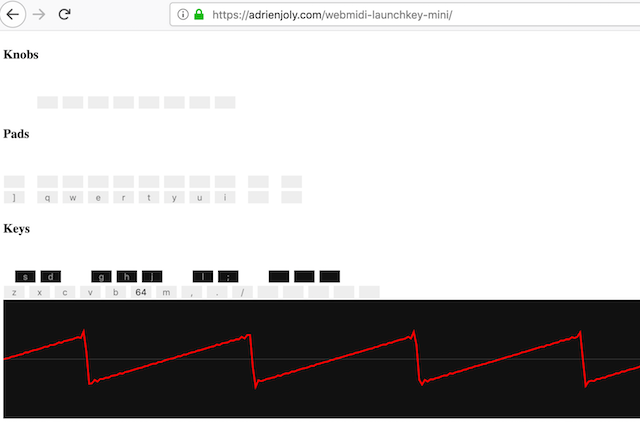

# WebMIDI Educational Synthesizer in Rust

A high-performance educational synthesizer with a real-time oscilloscope, written in Rust and compiled to WebAssembly. This project is designed for teaching the physics of sound and music synthesis. Originally based on the WebMIDI Launchkey Mini project.

It can be controlled using any MIDI controller, and with your computer's keyboard!



- Demo video: [youtube.com/watch?v=w-BsTGGIlwA](https://www.youtube.com/watch?v=w-BsTGGIlwA)
- Try it now: [adrienjoly.com/webmidi-launchkey-mini](https://adrienjoly.com/webmidi-launchkey-mini) (Note: this link points to the original JS version)

## Building and Running

This project requires Node.js, npm, and the Rust toolchain (including `rustup` and `cargo`).

1.  **Install dependencies:**
    ```bash
    npm install
    ```
2.  **Run the development server:**
    ```bash
    npm start
    ```
    This command will first build the Rust Wasm module and then start a local web server. The application will be available at `http://localhost:8080`.

## Features

### Synthesis Engines (Rust-based)
- **Basic Synthesizer** with standard waveforms (sine, square, sawtooth, triangle, pulse).
- **Additive Synthesizer** with real-time harmonic control:
  - 20 independent harmonic oscillators summed efficiently in Rust.
  - Real-time slider control for each harmonic amplitude.
  - Educational tool for understanding Fourier synthesis.

### Sound Effects
- Noise generator with built-in drum sounds:
  - Bass drum kick (press `Q`)
  - Snare drum (press `W`)
  - Closed hi-hat (press `E`)
  - Opened hi-hat / cymbal (press `R`)

### Professional Real-Time Oscilloscope
- **Displays the actual audio waveform** generated by the Rust synthesizer, not a computed approximation.
- **Stable waveform display** with eliminated jitter.
- **Professional trigger modes**: Auto, Single, Normal.
- **Accurate time base control** with multiple resolution settings.
- **Educational grid system** for precise measurements.

### Input Support
- Novation Launchkey Mini keyboard, or any other MIDI controller
- Computer QWERTY keyboard for note input and control

### Educational Value
- **Fourier Analysis Visualization**: Watch harmonic series build complex waveforms in real-time on the oscilloscope.
- **Physics of Sound**: Accurate waveform representation for educational use.
- **Synthesis Learning**: Interactive exploration of additive synthesis principles with a high-performance engine.

## Documentation

For complete technical details about the original oscilloscope improvements and implementation, see [OSCILLOSCOPE_COMPLETE_FIX.md](./OSCILLOSCOPE_COMPLETE_FIX.md).

## Contributors

- [Adrien Joly](https://github.com/adrienjoly) - Original developer
- [Jérôme Schneider](https://github.com/netgusto) - Original contributor
- [TheFermiSea](https://github.com/TheFermiSea) - Oscilloscope fixes and educational enhancements
